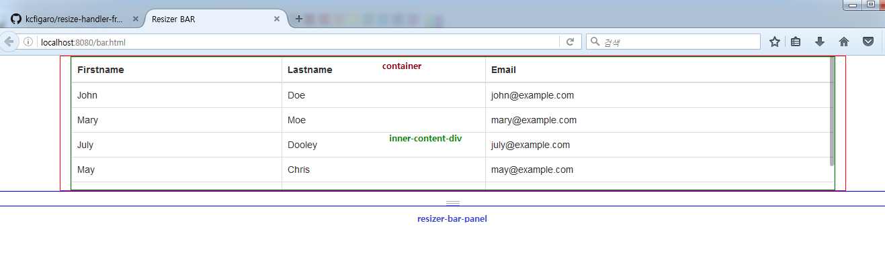

# KC's resizer bar with slimscroll - frontend development
resizer bar function and slimscroll using jquery - project by KC Chang

## Summary
- Develop javascript horizontal handler function to resize html section(div tag).
- Set slimscroll inside of content.
- The user can change section size up and down with mouse.
- The sizeable section change height using below method.

  ```javascript
  // currentHeight = the section's original height(using getComputedStyle).
  // currentY = the orignal section height from client(browser).
  // loc.pageY = the change section height from client(browser).
  //section.style.height = (startHeight + e.clientY - startY) + "px";
  var resizeHeight = Math.round(currentHeight + loc.pageY - currentY - 16);
  ```



- If you need more explaination of get style, please check [Here](http://www.w3schools.com/jsref/jsref_getcomputedstyle.asp)
- If you need more explaination of click location, please check [Here](http://felixblog.tistory.com/50).
- If you need more mouse event, please check [Here](https://developer.mozilla.org/en-US/docs/Web/Events/click).
- If you need more slimscroll, please check [Here](http://rocha.la/jQuery-slimScroll).

## Installation
**1**. CSS
- .row-icon-bar
- .row-resizer-bar

**2**. JS
- set variables for resizing functions.
- use initResize()
- use startResize()

**3**. HTML
- set id with class(id="resizer-bar-panel" class="row-resizer-bar") on div where you need to resize.
- set id (id="inner-content-div") on content which you want to make slimscroll.

## Resource
Essentials:
- Handle mouse events.
- Change default scroller to slimScroll.

Useful Links:
- How to adjust the size of multiple adjacent textareas like in jsfiddle.net? [Links](http://stackoverflow.com/questions/8819328/how-to-adjust-the-size-of-multiple-adjacent-textareas-like-in-jsfiddle-net)
- Building interactive elements with HTML and javascript: Resizing [Links](https://blog.codezero.xyz/building-interactive-elements-with-html-and-javascript-resizing/)
- jsfiddle example [Links](http://jsfiddle.net/3jMQD/)

## Validate source code
- [JShint](http://jshint.com/)
- [jsbeautifier](http://jsbeautifier.org/)
